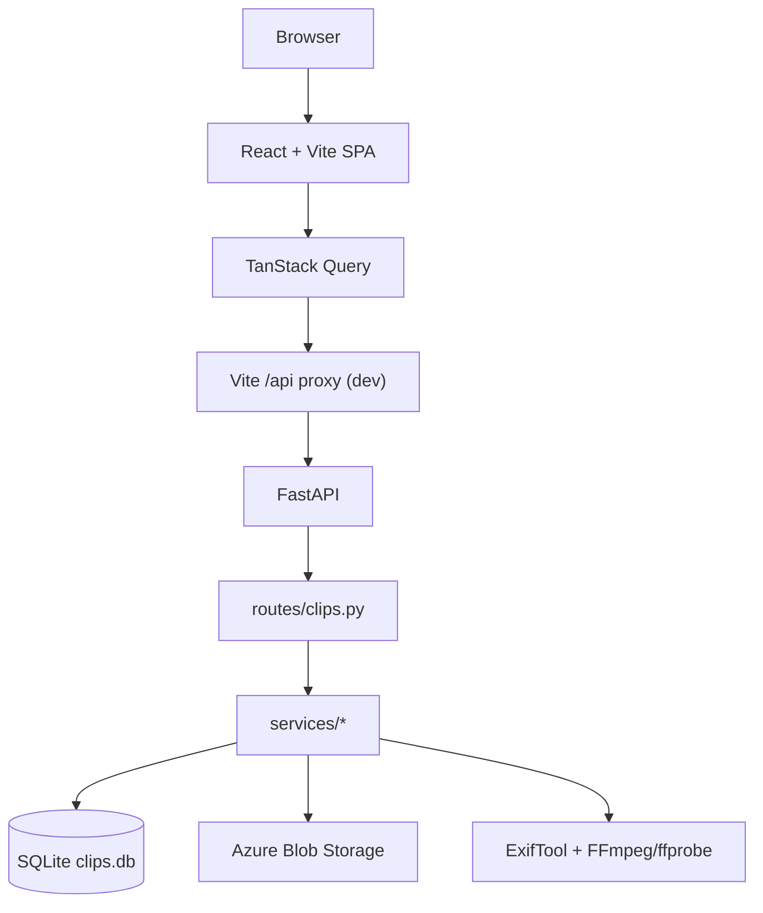
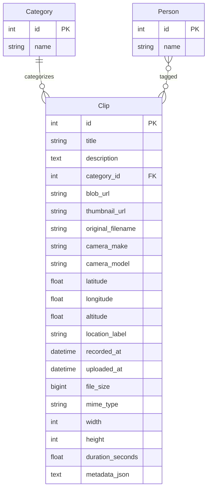

# Slyvr Architecture

Documented from the **current codebase** (repository checkpoint). Idealized future designs live in [FUTURE_ARCHITECTURE.md](./FUTURE_ARCHITECTURE.md).

---

## 1. Project overview

Slyvr is a **private media library** for personal video and photo archives. Users:

1. Land on a cinematic marketing page (`/`)
2. Enter the workspace (`/app`)
3. Upload media to Azure Blob Storage
4. Browse a grid of clips, filter by category/person, and search with ranked results
5. Open a clip inspector to edit fields and view extracted metadata
6. Optionally disconnect the API via the top-bar Active/Off control

There is **Supabase Auth** for identity. Media remains on FastAPI + SQLite + Azure. Privacy is enforced server-side via JWT verification and library/workspace membership — not by trusting the client.

---

## 2. High-level architecture



**Request path (dev):** browser → Vite (`localhost:5173`) → proxy `/api` → FastAPI (`127.0.0.1:8000`).  
**Optional:** `VITE_API_URL` points the Axios client directly at a backend URL.

---

## 3. Repository structure

| Path | Ownership |
|------|-----------|
| `frontend/` | SPA: pages, components, hooks, React Query, motion |
| `Backend/` | FastAPI entry (`main.py`), routes, SQLAlchemy models, services |
| `Backend/temp_uploads/` | Runtime upload scratch (gitignored) |
| `Backend/clips.db` | Local SQLite database (gitignored) |
| `docs/` | Architecture, status, decisions |
| `.agents/` | Cursor skill tooling (gitignored; not product runtime) |

---

## 4. Frontend architecture

### Routing

| Path | Component | Notes |
|------|-----------|--------|
| `/` | `LandingPage` | Eager-loaded |
| `/login`, `/signup` | `AuthPage` | Supabase email/password |
| `/app` | `Dashboard` | Lazy-loaded; requires session unless `?demo=1` |
| `*` | Navigate → `/` | |

Entrypoint: `frontend/src/main.tsx` → `AppProviders` → `App`.

### Providers

`AppProviders` wraps:

- `QueryClientProvider` (staleTime 30s, retry 1, no refetch on focus)
- `LazyMotionRoot` (Framer Motion `domAnimation` feature set)
- Sonner `Toaster` (unstyled, dark)

### Workspace hierarchy

```text
Dashboard
├── Sidebar (categories / people)
├── Topbar (search + BorderBeam, API status, upload, refresh)
├── SearchFacetBar (when searching)
├── ClipGrid → ClipCard (3D card)
├── ClipDetailsDrawer → ClipInspectorForm → ClipMetadataSections
└── UploadModal
```

### Hooks (selected)

| Hook | Role |
|------|------|
| `use-clips-queries` | Categories, people, clips, search, mutations, health |
| `use-api-connection` | User connection gate + health fetch on activate |
| `use-debounced-value` | Search debounce (~250ms) |
| `use-reduced-motion` | `prefers-reduced-motion` |
| `use-dialog-focus` | Focus trap / restore for dialogs |
| `use-landing-opening-scroll` | Hero scroll transforms |

### API abstraction

- `lib/api-client.ts` — Axios instance (`baseURL` from `VITE_API_URL` or `/api`)
- `services/api.ts` — typed endpoint helpers
- `lib/query-keys.ts` — React Query key factory

### UI primitives

Under `frontend/src/components/ui/`: motion button, confirm dialog, empty state, shimmer skeletons, toast body, 3D card, BorderBeam, API status icon, search pulse.

Path alias `@/` → `frontend/src` (Vite).

---

## 5. Backend architecture

### Entrypoint

`Backend/main.py`:

- Creates FastAPI app titled `Slyvr`
- Mounts `routes.clips.router`
- Enables CORS `allow_origins=["*"]`
- Calls `ensure_schema()` for SQLite create + nullable column migrations
- Defines `POST /upload` and `GET /health`

### Layers

| Layer | Location | Role |
|-------|----------|------|
| Routes | `routes/clips.py` | HTTP → service / ORM |
| Services | `services/*` | Search, metadata, Azure, FFmpeg, legacy Exif |
| Models | `models.py` | SQLAlchemy entities |
| Schemas | `schemas/clip_schema.py` | Pydantic response models |
| Serializer | `services/clip_serializer.py` | Clip → API dict (incl. `metadata_json` parse) |
| Database | `database.py` | Engine, session, `ensure_schema` |

### Notable services

| Module | Role |
|--------|------|
| `metadata_service.py` | ExifTool JSON + ffprobe → structured metadata |
| `search_service.py` | Candidate SQL + RapidFuzz scoring + facets |
| `ffmpeg_service.py` | Video thumbnail via FFmpeg |
| `azure_service.py` | Blob upload/delete |
| `exif_service.py` | Legacy narrow ExifTool helper (upload uses `metadata_service`) |
| `clip_service.py` | CRUD helpers; legacy ILIKE `search_clips` retained |

---

## 6. Upload / ingestion pipeline

```text
multipart POST /upload (field name: video)
  → write temp file under Backend/temp_uploads/
  → extract_media_metadata()  [non-fatal on failure]
  → thumbnail: copy for images OR FFmpeg still for video
  → upload media + thumbnail to Azure
  → insert Clip row (+ people M2M)
  → delete temp files
  → JSON response { clip_id, urls, metadata }
```

**Images:** detected by extension / `content_type`; original file copied as thumbnail.  
**Videos:** FFmpeg thumbnail at ~1s.  
**Metadata failure:** logged; upload continues with nulls.  
**Azure / FFmpeg hard failure:** HTTP 500; temps cleaned in `except`.

Frontend `UploadModal` accepts video + common image MIME types; React Query invalidates clip lists after success.

---

## 7. Metadata architecture

### Normalized `clips` columns

| Column | Role |
|--------|------|
| `original_filename`, `stored_filename`, `file_size`, `mime_type` | File identity |
| `width`, `height`, `duration_seconds` | Media geometry / length |
| `camera_make`, `camera_model` | Device (denormalized for search) |
| `latitude`, `longitude`, `altitude` | Raw GPS |
| `location_label` | Optional human label (nullable; not auto-geocoded) |
| `recorded_at`, `uploaded_at` | Capture vs ingest time |
| `metadata_json` | Full structured JSON blob |

### `metadata_json` shape (from `metadata_service`)

- `file` — filename, size, mime, extension, width, height  
- `capture` — captured_at, camera/lens, exposure fields, orientation, color space  
- `location` — lat/lng/altitude, gps timestamp  
- `video` — duration, codec, frame rate, bitrate, container, audio fields  

All fields are **nullable**. Missing EXIF does not invent values.

**Derived (UI only):** OpenStreetMap link from coordinates in the inspector (no server geocoding).

---

## 8. Search architecture

### Endpoint

`GET /clips/search?q=&person=&category=&device=&year=&location=&file_type=`

Returns `{ clips: Clip[], facets: { people, categories, devices, years, locations, file_types } }`.

### Flow

1. Tokenize query (`[a-z0-9]+`, length ≥ 2)  
2. SQL candidate pass: `ILIKE` on title, description, filenames, camera, location, mime, `metadata_json`, category name; plus people name join  
3. If no SQL hits: typo fallback scans recent titles with RapidFuzz thresholds  
4. Score each candidate (`_score_clip`); drop scores &lt; 40 or without a “hard hit”  
5. Sort by score desc; apply facet filters; build facets from final set  

### Scoring (actual)

Hard hits include: exact/prefix/substring title match; strong title fuzzy (`partial_ratio` ≥ 78 or `token_set_ratio` ≥ 72); token matches in title/category/people/description/filename/location/device; per-word typo tolerance on title words (≥ 4 chars, partial ≥ 82).  
Bonus when all query tokens match. Soft fuzzy on unrelated docs is **not** enough alone (`hard_hit` required).

### Frontend

- Debounced query (~250ms)  
- `useSearchClipsQuery` keyed by full param object  
- Facet bar only while search active; empty facets hidden  
- Sidebar category/person also passed into search params when set  

---

## 9. API connection architecture

| Piece | Behavior |
|-------|----------|
| `useApiConnection` | Local `connectionEnabled`; gates React Query `enabled` for library data |
| `GET /health` | Backend liveness `{ status: "healthy" }` |
| Activate | `fetchQuery` health; failure → disconnect + error toast |
| Deactivate | Sets `connectionEnabled` false (stops polling/refetch) |
| `ApiStatusIcon` | Motion pathLength X ↔ check via shared progress value |
| Topbar control | Compact button; `aria-pressed` / `aria-busy`; reduced-motion snaps |

Health remains the **source of truth** when connected; animation only reflects visual state.

---

## 10. UI / motion architecture

| Concern | Implementation |
|---------|----------------|
| Shared tokens | `lib/motion.ts` — tweens (micro/UI/surface/cinematic), springs, variants |
| Reduced motion | `useReducedMotion` + early returns / duration 0 |
| Media cards | `3d-card` pointer tilt + CardItem translateZ; no continuous loops |
| Drawer / modal | Slide / scale+fade variants + backdrop |
| Search | BorderBeam on focus/query only |
| API status | SVG pathLength transforms |
| Landing | Scroll-linked hero (`use-landing-opening-scroll`); restrained section reveals |
| Toasts | Framer Motion body + Sonner |

Reusable: motion presets, 3D card, BorderBeam, ApiStatusIcon, MotionButton.  
Component-specific: landing scroll ranges, ClipCard depth values, ApiStatus keyframes.

---

## 11. Data model



Association table: `clip_people (clip_id, person_id)`.

Schema evolution: `database.ensure_schema()` runs `CREATE TABLE` then `ALTER TABLE ... ADD COLUMN` for new nullable fields on existing SQLite DBs (no Alembic).

---

## 12. API surface

| Method | Path | Purpose | Key params / body |
|--------|------|---------|-------------------|
| GET | `/health` | Liveness | — |
| POST | `/upload` | Ingest media | multipart: `video`, `title`, `description`, `category_id`, `person_ids` |
| GET | `/clips` | List all clips | — |
| GET | `/clips/search` | Ranked search + facets | `q`, facet filters |
| GET | `/clips/{id}` | Clip detail | — |
| PUT | `/clips/{id}` | Update title/description/category | JSON |
| DELETE | `/clips/{id}` | Delete clip (+ best-effort blob delete) | — |
| GET | `/categories` | Categories wrapped object | — |
| GET | `/categories/all` | Category list | — |
| POST | `/categories` | Create category | `{ name }` |
| DELETE | `/categories/by-name/{name}` | Delete category | — |
| GET | `/people` | People list | — |
| POST | `/people` | Create person | `{ name }` |
| DELETE | `/people/by-name/{name}` | Delete person | — |

---

## 13. State management

| Kind | Examples |
|------|----------|
| Server state | Clips, categories, people, health, search results (React Query) |
| Local UI state | Search string, facets, sidebar selection, drawer open, upload modal, connectionEnabled |
| Derived | Filtered grid (browse mode), empty-state kind, storage totals |
| Connection state | `useApiConnection` visualState / isToggling |

No Redux / Zustand. Landing uses local motion + scroll hooks.

---

## 14. Error handling

| Area | Behavior |
|------|----------|
| Upload | Toast + modal phase; backend 500 with cleanup |
| Metadata extract | Warning log; continue upload |
| Mutations | `motionToast.error(getApiErrorMessage)` |
| Search / list | Dashboard alert banner on query error |
| API activate fail | Toast; remain disconnected |
| Blob delete fail | Logged; DB row still removed |

---

## 15. Accessibility

**Present:** dialog focus trap (`use-dialog-focus`); Escape closes; aria-modal / labelledby; clip cards keyboard Enter/Space; API control `aria-pressed`/`aria-busy`; search sr-only label; reduced-motion disables 3D / BorderBeam / heavy path animation.

**Gaps:** no auth; limited live-region announcements for search result counts; some landing decorative content `aria-hidden`.

---

## 16. Performance

| Area | Current approach | Risk |
|------|------------------|------|
| Grid | Sectioned list; layout animations capped (~120 cards) | 10k+ DOM cards will struggle |
| Search | SQL candidates + in-memory score; typo scan ≤800 rows | Full-table fuzzy does not scale |
| Metadata | Sync ExifTool/ffprobe on upload request | Slow/large files block the HTTP worker |
| Query cache | 30s staleTime | Fine for personal use |
| Motion | Transform/opacity; LazyMotion | Prefer no layout thrash on hover |

---

## 17. Security / privacy

- **Secrets:** `AZURE_CONNECTION_STRING`, `SUPABASE_JWT_SECRET` in `Backend/.env` (gitignored). Frontend may use public `VITE_SUPABASE_URL` / `VITE_SUPABASE_ANON_KEY` only.  
- **CORS:** explicit allowlist (not `*`).  
- **Auth:** Bearer Supabase JWT; active library via `X-Library-Id` verified server-side.  
- **GPS:** stored as raw coordinates; no third-party geocoder; OSM link is client-side only.  
- **Uploads:** original bytes preserved; temp files deleted after success/failure; `uploaded_by_user_id` from JWT only.  
- **Public exposure:** treat Azure URLs and API as private infrastructure; demo is static frontend-only.

---

## 18. Deployment architecture

**Not configured in-repo:** no Dockerfile, no CI workflows, no IaC, no production compose file.

Runnable locally via uvicorn + Vite. Production would require separately provisioning Azure Blob, a host for FastAPI, a static host for the SPA, and env vars — none of that is defined here.

---

# Architectural assessment

### Strong

- Clear frontend/backend separation with typed API helpers  
- React Query for server state; connection gating is explicit  
- Metadata nullable + structured JSON preserves originals  
- Search is server-side with real ranking (not client-only)  
- Motion system centralized with reduced-motion awareness  
- SQLite column migration helper avoids wiping existing DBs  

### Acceptable

- Monolithic FastAPI `main.py` upload route (works; could move to router later)  
- Dual Exif paths (`exif_service` legacy vs `metadata_service`)  
- CORS wide open for local/dev convenience  
- Facets recomputed from result set only (no global facet index)  

### Technical debt

- No Alembic; ad-hoc `ALTER TABLE` list  
- Upload field still named `video` for images  
- Seed/perf scripts and leftover landing experiments  
- `frontend/@/` shadcn path alongside `src/components/ui`  
- No automated test suite for search scoring or upload  

### Scalability risks

| Scale | Concern |
|-------|---------|
| 100 | Comfortable |
| 1,000 | Grid + SQLite OK; upload sync metadata may feel slow |
| 10,000 | In-memory score/fallback and full grid render degrade |
| 100,000+ | Needs async processing, object listing strategy, search index |

### Security risks

- No authentication/authorization  
- CORS `*`  
- Blob URLs may be guessable/long-lived depending on Azure config (outside this repo)  

### Reliability risks

- Sync metadata/thumbnails on request thread  
- Azure outage fails uploads hard  
- SQLite single-writer under concurrent uploads  

### Maintainability risks

- Large landing component surface  
- Search scoring thresholds are magic numbers  
- Documentation and code can drift without CI checks  
